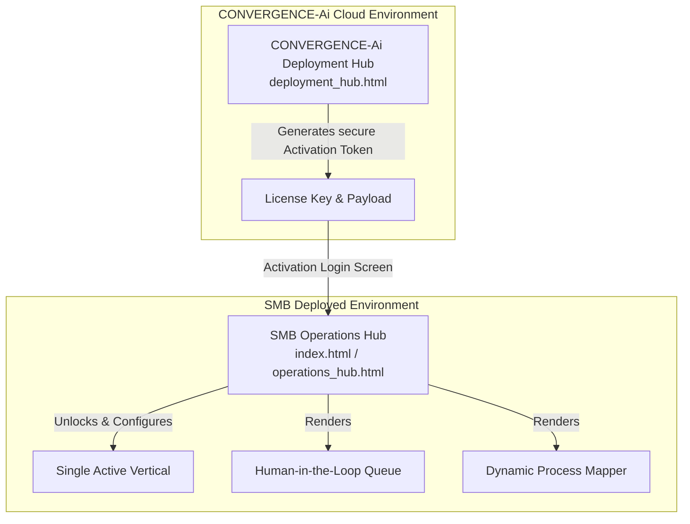

# Implementation Plan: CONVERGENCE-Ai Admin Assistant™ Portal, Deployment Hub & Operations Hub

Build the **CONVERGENCE-Ai Admin Assistant™ (CONVERGENCE-Ai Admin Assistant)**, a production-grade, multi-tenant AI agent automation platform. 

Based on your updated requirements, we will implement **two primary high-fidelity hubs** directly in your workspace:
1. **CONVERGENCE-Ai Deployment Hub (`deployment_hub.html`)**: The Super Admin remote command console used by CONVERGENCE-Ai to configure client instances, select and lock the industry vertical, generate vault-grade secure activation tokens, and deploy the agent remotely.
2. **SMB Operations Hub (`operations_hub.html` / `index.html`)**: The client's secure back-office portal deployed in their local environment. It begins with an activation lock screen requiring a valid licensing token. Once activated, it displays their single locked industry vertical and serves as the operational dashboard for agent workflows, process mapping, and human-in-the-loop oversight.

---

## User Review Required

Please review the updated multi-hub file structure and the secure token activation handshake mechanism.

> [!IMPORTANT]
> **Secure Handshake & Activation Lock**:
> - **Deployment Hub** generates an encrypted **Activation Payload** containing the client details, locked vertical, and vault-level parameters.
> - **Operations Hub** starts in a locked state. Entering the Activation Key unlocks the interface, establishing the client’s brand style and enabling the single active vertical while locking all others.

> [!WARNING]
> **Human-in-the-Loop (HITL) Enforcement**:
> - Any high-risk financial, customer-facing, or travel operations generated by the agent will be placed in the Operations Hub's HITL approval queue, requiring manual administrator verification before execution.

---

## Proposed System Architecture

---

## Proposed Technical File Architecture in Workspace

We will build the following production-ready application layout in `c:\Users\dahao\.gemini\antigravity\scratch\aiwx-admin-agent`:

* **[NEW] [deployment_hub.html](file:///c:/Users/dahao/.gemini/antigravity/scratch/aiwx-admin-agent/deployment_hub.html)**: 
  - The Remote Super Admin console.
  - Generates client deployments, manages endpoints, configures security keys, selects 1-of-12 industry verticals, and outputs activation tokens.
  - Stunning premium deep blue and gold aesthetic matching `CONVERGENCE-Ai.com`.
* **[NEW] [operations_hub.html](file:///c:/Users/dahao/.gemini/antigravity/scratch/aiwx-admin-agent/operations_hub.html)** (also copied to `index.html` as the entrypoint):
  - The secure back-office platform.
  - Interactive "Login / Activation" modal to paste the token.
  - Once active, renders the custom SMB workspace (12 verticals, locked to the selected one).
  - Fully white-labelable theme builder (modify name, logo, colors in real-time).
  - Dynamic Process Mapping Studio (SVG-based visualizer for BPMN flowcharts, Swimlanes, and SIPOCs).
  - HITL Approval console with simulated tasks (emails, invoices, travel bookings).
* **[NEW] [styles.css](file:///c:/Users/dahao/.gemini/antigravity/scratch/aiwx-admin-agent/styles.css)**: 
  - Premium CSS design system shared across hubs.
  - Features custom properties for color systems, interactive animations, custom typography, glassmorphism layers, and mobile-responsive cards.
* **[NEW] [app.js](file:///c:/Users/dahao/.gemini/antigravity/scratch/aiwx-admin-agent/app.js)**: 
  - Shared JavaScript controller handling state, process parsing, security verification simulation, rebranding, and interactive dashboards.
* **[NEW] [DEPLOYMENT.md](file:///c:/Users/dahao/.gemini/antigravity/scratch/aiwx-admin-agent/DEPLOYMENT.md)**:
  - Technical blueprint detailing the open-source production stack (Supabase, Docker, Dify.ai, LangGraph, n8n) and vault security integration instructions.

---

## Verification Plan

### Automated & Manual Verification
1. **End-to-End Activation Loop**:
   - Open `deployment_hub.html`, fill in the client info, select "Real Estate" or another vertical, and click **Generate Activation Token**.
   - Copy the generated token.
   - Open `operations_hub.html` (which initially displays a vault lock screen), paste the token, and click **Activate**.
   - Verify that the Operations Hub unlocks, automatically brands itself, and enables the selected vertical while disabling all others.
2. **Process Mapping Studio Test**:
   - Select a task (e.g., "Procure-to-Pay Invoice Processing").
   - Click "Generate Process Map" and confirm the SVG visually renders the Swimlane or SIPOC process map with live active node highlight animations.
3. **HITL Test**:
   - Review pending tasks in the Operations Hub queue.
   - Click "Approve" or "Reject" and verify that it updates task metrics and logs a secure activity trail.
