# CONVERGENCE-Ai™ Cloud-Native AI Automations Hub
## Comprehensive Product Scope, Asset Inventory, and Modular System Architecture
*Prepared for Founders: Dahaomine Moody-Ward & Josette C. Kelley*
*Current Version: 1.1.0 (Enterprise Compliant)*

---

## 📖 1. Executive Summary & Value Proposition

The **CONVERGENCE-Ai™ Cloud-Native AI Automations Hub** (transitioned to the **AiWorXmiths** visual brand accent system) is a modular, high-fidelity middleware framework and operational cockpit. It bridges serverless AI agents (e.g., self-hosted **Dify.ai**, **LangGraph**, **LangChain**, and **n8n.io**) directly with client business systems, public footprint intelligence registries, and social media posting channels.

```
+-------------------------------------------------------------------------------+
|                            CONVERGENCE-AI PROPOSITION                         |
|                                                                               |
|   1. ZERO VENDOR LOCK-IN: Runs entirely on self-hosted open-source stacks.    |
|   2. VAULT-GRADE SECURITY: Cryptographic credential insulation (AES-256-GCM). |
|   3. HYBRID HITL PARADIGM: Upskills human teams to review/validate AI agents. |
|   4. DYNAMIC MULTI-TENANCY: Programmatic licensing and vertical restrictions. |
+-------------------------------------------------------------------------------+
```

The platform's flagship capabilities are divided into two main offerings:
1. **The SMB External Audit Engine & Workforce AI Planner**: A pre-sales and consulting tool that analyzes a client domain’s security posture, marketing tags, web performance, and state/federal regulatory filings to automatically calculate an overall maturity score. It maps job roles to automation exposure and schedules a custom **90-Day Human-in-the-Loop (HITL) Transition Timeline**.
2. **The Campaign Auto-Scheduler & Headless Direct Posting Engine**: A social media campaign orchestration system. It schedules campaigns across a Monday-Wednesday-Friday cadence, and uses Puppeteer browser automation to post directly to Meta channels (Facebook, Instagram, Threads) using active browser cookies, completely bypassing restrictive developer API applications.

---

## 📊 2. Complete Modular System Architecture Diagram

The system operates as an Express.js API gateway serving premium, glassmorphic HTML SPAs styled in navy/slate backgrounds (`#002354`), electric blue (`#0086EF`/`#009EE6`), and cyan highlights. Below is the complete system dataflow and components interaction diagram:

```mermaid
graph TB
    subgraph Client Portal & Marketing Funnel
        A["index.html (Auditor Client Console)"]
        B["smb_landing.html / solopreneur_landing.html"]
        C["reseller_landing.html / product.html"]
    end

    subgraph Operations & Training Control
        D["operations_hub.html (Client Ops Portal)"]
        E["deployment_hub.html (Super Admin Control)"]
        F["training_hub.html (Consultant Academy)"]
        G["product_documentation.html (Master Docs Portal)"]
    end

    subgraph Social Media & Campaign Hub
        H["social_media_hub.html (GTM Posting Terminal)"]
        I["media_library_manager.html (Asset Manager)"]
    end

    subgraph Express.js API Gateway [server.js / Port 3003]
        J["/api/audit (Run Crawl & Scour)"]
        K["/api/publish-post (Direct Subprocess Run)"]
        L["/api/analytics (GA4 Live Data Fetch)"]
        M["/api/schedule-campaign & /api/toggle-scheduler"]
        N["Scheduler Background Loop (60s tick)"]
    end

    subgraph Intelligence & Scoring Engine
        O["lib/scraper.js (HTTPS & WAF Prober)"]
        P["lib/scourer.js (Firecrawl Public Scourer)"]
        Q["lib/analyzer.js (SWOT & Outreach Generator)"]
        R["lib/workforce.js (Workforce AI Planner)"]
    end

    subgraph Automation & Headless Publishing Layer
        S["publish_headless.js (Puppeteer Browser Automation)"]
        T["test_headless_connection.js (Session Auth Diagnostics)"]
        U["parse_netscape_cookies.js (Netscape Cookie Parser)"]
    end

    subgraph Cryptographic Shield & Database
        V["KMS Key Decryption Sandbox (AES-256-GCM)"]
        W["Supabase PostgreSQL Database (Row-Level Security)"]
    end

    subgraph Third-Party Integrations
        X["Firecrawl API (Public Records & Filings)"]
        Y["Google Analytics 4 (Campaign Traffic Data)"]
        Z["Social Platforms (Facebook, Instagram, Threads)"]
        AA["External Systems (n8n, Dify.ai, Twilio, QuickBooks)"]
    end

    %% Flow connections
    A & B & C -->|Request Audit / View Portal| J
    D -->|Activation License Handshake| V
    E -->|Select Vertical / Generate License Token| V
    F -->|Load Workforce Matrix| R
    H -->|Queue Campaigns / Direct Publish| K & M
    
    J -->|Run Crawler| O
    O -->|Fetch HTML & Headers| X
    J -->|Run Scourer| P
    P -->|Extract Filings & Financials| X
    J -->|Process Scores| Q
    J -->|Plan Upskilling| R
    
    K & N -->|Trigger Direct Posting| S
    S -->|Inject Session Cookies| U
    S -->|Upload & Direct Post| Z
    T -->|Validate Session Auth| Z
    
    J & K & M -->|Read/Write Session & Logs| W
    V -->|Enforce Tenant Vertical Lockdown| W
    
    L -->|Fetch Campaign Conversion Clicks| Y
    AA <-->|Workflows & Webhooks| J
```



---

## 🛠️ 3. Technical Module Scope & System Components

### 3.1. SMB External Audit & Intelligence Engine
- **🌐 Relational Domain Ingestion**: Dynamically resolves domain queries, scrubs prefix garbage, probes subdomains (`www`, `mail`, `portal`), and extracts raw HTML metadata (page titles, descriptions, open-graph protocols).
- **🛡️ HTTPS Handshake & Edge WAF Probing**: Audits response headers in under 200ms to identify active Web Application Firewalls (Cloudflare, AWS WAF, Akamai, Imperva, Sucuri) and checks security configurations (HSTS, Content Security Policy (CSP), X-Frame-Options, CORS access controls).
- **🔍 Regulatory Scouring (Firecrawl API)**: Queries public registries via Firecrawl to gather state secretary filing status (CA, DE, NY), SEC CIK filing registries, IRS tax exemption databases, and regional news mentions.
- **📊 Algorithmic SWOT & Maturity Matrix**: Processes raw metrics using a deterministic algorithm in [lib/analyzer.js](file:///c:/Users/dahao/.gemini/antigravity/scratch/aiwx-smb-auditor/lib/analyzer.js) to grade domains (Technology, Security, Marketing) and select pre-sales outreach scripts.
- **🔌 Premium Smart Simulator Fallback**: Automatically activates vertical-specific mocks (Healthcare, Legal, Real Estate, Professional Services) if the Firecrawl API key is missing or exhausted, ensuring zero UI downtime.

### 3.2. Workforce AI Transition Planner (Human-in-the-Loop)
- **🤖 Automation Exposure Scoring**: Evaluates standard roles (Support, Accounting, Marketing, Admin) and marks exposure risks based on daily operational tasks.
- **📈 Upskilling Roadmaps**: Maps staff roles to next-generation hybrid titles (e.g. *Customer Support Rep* to *AI Helpdesk Trainer*; *Billing Specialist* to *AI Claims Auditor*) with target modules for learning.
- **📋 Operations HITL Queue**: Holds high-risk automated transactions (e.g., invoice transfers exceeding 5% variance or patient calendar updates) in a pending buffer for manual human validation, resolving script hallucinations.

### 3.3. Campaign Auto-Scheduler & Headless Publisher
- **📅 Services GTM Calendar**: Orchestrates a 9-post, 3-week services-focused campaign (cadenced Monday-Wednesday-Friday) designed to generate audit prospects. Product posts are archived to a content backlog to maintain a professional service tone.
- **⚡ Puppeteer Session Cookies Injection**: Bypasses Meta developer app configurations and OAuth handshakes by parsing Netscape-formatted browser cookies and injecting them directly into Puppeteer chromium contexts.
- **⚙️ Background Scheduler Daemon**: Runs on a 60-second loop inside [server.js](file:///c:/Users/dahao/.gemini/antigravity/scratch/aiwx-smb-auditor/server.js), cross-checking the active timetable in [campaign_schedule.json](file:///c:/Users/dahao/.gemini/antigravity/scratch/aiwx-social-media-agent/config/campaign_schedule.json), publishing due posts, and updating the status flags (`✓`, `⏰`, `⚙️`, `❌`) in the UI calendar.
- **🔔 Native Windows OS Notifications**: Utilizes a PowerShell script [send_notification.ps1](file:///c:/Users/dahao/.gemini/antigravity/scratch/aiwx-social-media-agent/send_notification.ps1) and the `node-notifier` library to dispatch desktop balloon alerts when scheduling posts succeed or fail.

### 3.4. Security, Multi-Tenancy & Licensing Gateway
- **🔑 Cryptographic License Token**: The Super Admin uses the [deployment_hub.html](file:///c:/Users/dahao/.gemini/antigravity/scratch/aiwx-convergence-ai/deployment_hub.html) to input client configs, target industry verticals, and custom styling overrides, generating a signed Base64 token.
- **🔒 Operations Lockdown Overlay**: Unlocking the [operations_hub.html](file:///c:/Users/dahao/.gemini/antigravity/scratch/aiwx-convergence-ai/operations_hub.html) requires pasting this token. Decrypting it locks the entire workspace instance exclusively to the designated vertical, disabling access to other sectors.
- **🛡️ Database Row-Level Security**: Persistence is managed in Supabase PostgreSQL tables where access to configuration credentials is isolated by tenant hash IDs, and database keys are encrypted at rest using AES-256-GCM.
- **🛡️ XSS Hardened History Ledger**: Replaced legacy vulnerable `innerHTML` templates in [smb-auditor.html](file:///c:/Users/dahao/.gemini/antigravity/scratch/aiwx-smb-auditor/smb-auditor.html) and [admin.js](file:///c:/Users/dahao/.gemini/antigravity/scratch/aiwx-smb-auditor/public/admin/admin.js) with secure DOM element trees utilizing `textContent` filters, preventing malicious domains from clearing active client storage configurations.

### 3.5. Live LLM Gateway & Reseller Configuration
- **🤖 Models Gateway Routing**: Dynamically connects to public/private models (Google Gemini, OpenAI, Claude, or local Ollama). It allows administrators to update models, enter developer API keys, and test connectivity.
- **💲 Reseller Markup Calculations**: Resellers can specify custom utility markups (e.g. 30%) in the settings panel to automatically calculate pass-through token costs for client billing.
- **✍️ Inline AI Compose**: Integrates an AI draft review section within the HITL operations queue, allowing managers to inspect, edit, and audit agent-generated emails or proposals before releasing them.

---

## 🗃️ 4. System Asset Inventory & File Registry

The modular system is divided across three key directory repositories representing the Admin Hub, the SMB Auditor Web Server, and the Social Media Campaign Agent:

| File Name | Location / Path | Purpose & Description |
| :--- | :--- | :--- |
| **`server.js`** | [aiwx-smb-auditor](file:///c:/Users/dahao/.gemini/antigravity/scratch/aiwx-smb-auditor/server.js) | Core Node Express gateway routing server, scheduling loop, and API endpoints handler. |
| **`index.html`** | [aiwx-smb-auditor/public](file:///c:/Users/dahao/.gemini/antigravity/scratch/aiwx-smb-auditor/public/index.html) | Main SMB Auditor Client Dashboard. Renders domain audits, tech graphs, and ROI metrics. |
| **`smb-auditor.html`**| [aiwx-smb-auditor](file:///c:/Users/dahao/.gemini/antigravity/scratch/aiwx-smb-auditor/smb-auditor.html) | Consultant Audit Command Center featuring the client audit ledger and domain scoping form. |
| **`product.html`** | [aiwx-smb-auditor/public](file:///c:/Users/dahao/.gemini/antigravity/scratch/aiwx-smb-auditor/public/product.html) | Public pricing page featuring subscription tiers, pricing sliders, and competitor matrix. |
| **`deployment_hub.html`**| [aiwx-convergence-ai](file:///c:/Users/dahao/.gemini/antigravity/scratch/aiwx-convergence-ai/deployment_hub.html) | Super Admin portal for styling configurations, vertical locking, and token generation. |
| **`operations_hub.html`**| [aiwx-convergence-ai](file:///c:/Users/dahao/.gemini/antigravity/scratch/aiwx-convergence-ai/operations_hub.html) | Client Operations console containing the onboarding wizard and the HITL pending queue. |
| **`training_hub.html`** | [aiwx-convergence-ai](file:///c:/Users/dahao/.gemini/antigravity/scratch/aiwx-convergence-ai/training_hub.html) | Consultant training academy containing the Workforce Upskilling Matrix. |
| **`social_media_hub.html`**| [aiwx-social-media-agent](file:///c:/Users/dahao/.gemini/antigravity/scratch/aiwx-social-media-agent/social_media_hub.html) | Campaign posting board with auto-scheduler controls, Puppeteer logs, and cookie guide. |
| **`media_library_manager.html`**| [aiwx-smb-auditor](file:///c:/Users/dahao/.gemini/antigravity/scratch/aiwx-smb-auditor/media_library_manager.html) | Client asset storage and uploads dashboard. |
| **`product_documentation.html`**| [aiwx-convergence-ai](file:///c:/Users/dahao/.gemini/antigravity/scratch/aiwx-convergence-ai/product_documentation.html) | Master documentation portal detailing roadmaps, PRD, SDD, APIs, and release logs. |
| **`styles.css`** | [aiwx-convergence-ai](file:///c:/Users/dahao/.gemini/antigravity/scratch/aiwx-convergence-ai/styles.css) | Core styles file specifying the slate-blue glassmorphic theme tokens. |
| **`lib/scraper.js`** | [aiwx-smb-auditor/lib](file:///c:/Users/dahao/.gemini/antigravity/scratch/aiwx-smb-auditor/lib/scraper.js) | Scrapes domain HTTP headers, parses metadata, and flags edge WAF layers. |
| **`lib/scourer.js`** | [aiwx-smb-auditor/lib](file:///c:/Users/dahao/.gemini/antigravity/scratch/aiwx-smb-auditor/lib/scourer.js) | Integrates Firecrawl search APIs to compile financial, headcount, and regulatory history. |
| **`lib/analyzer.js`** | [aiwx-smb-auditor/lib](file:///c:/Users/dahao/.gemini/antigravity/scratch/aiwx-smb-auditor/lib/analyzer.js) | Calculates tech vulnerability indices, SWOT outputs, pricing estimates, and outreach. |
| **`lib/workforce.js`**| [aiwx-smb-auditor/lib](file:///c:/Users/dahao/.gemini/antigravity/scratch/aiwx-smb-auditor/lib/workforce.js) | Workforce exposure matrix databases, transition parameters, and timeline templates. |
| **`publish_headless.js`**| [aiwx-social-media-agent](file:///c:/Users/dahao/.gemini/antigravity/scratch/aiwx-social-media-agent/publish_headless.js) | Headless Puppeteer engine script using cookies to bypass Meta walls. |
| **`test_headless_connection.js`**| [aiwx-social-media-agent](file:///c:/Users/dahao/.gemini/antigravity/scratch/aiwx-social-media-agent/test_headless_connection.js) | Diagnostic script to test active cookie sessions on Facebook, Instagram, Threads. |
| **`parse_netscape_cookies.js`**| [aiwx-social-media-agent](file:///c:/Users/dahao/.gemini/antigravity/scratch/aiwx-social-media-agent/parse_netscape_cookies.js) | Utility that parses Netscape Netscape text cookies into Puppeteer JSON formats. |
| **`build_pdfs.py`** | [aiwx-convergence-ai](file:///c:/Users/dahao/.gemini/antigravity/scratch/aiwx-convergence-ai/build_pdfs.py) | Python generator script creating three PDF deliverables (PRD, SOP manual, verticals). |
| **`generate_assets.py`**| [aiwx-social-media-agent](file:///c:/Users/dahao/.gemini/antigravity/scratch/aiwx-social-media-agent/generate_assets.py) | Python compiler executing pdf compilations for posting plans and editorial calendars. |
| **`supabase_schema.sql`**| [aiwx-convergence-ai](file:///c:/Users/dahao/.gemini/antigravity/scratch/aiwx-convergence-ai/supabase_schema.sql) | SQL schema creating tenant encryption tables, logs metrics, and RLS guidelines. |
| **`campaign_schedule.json`**| [aiwx-social-media-agent/config](file:///c:/Users/dahao/.gemini/antigravity/scratch/aiwx-social-media-agent/config/campaign_schedule.json) | Central campaign calendar tracking the 9 services-focused posts and execution states. |
| **`cookies_*.json`** | [aiwx-social-media-agent/config](file:///c:/Users/dahao/.gemini/antigravity/scratch/aiwx-social-media-agent/config/) | Decrypted cookie structures containing verified session identifiers. |
| **`test/run.js`** | [aiwx-smb-auditor/test](file:///c:/Users/dahao/.gemini/antigravity/scratch/aiwx-smb-auditor/test/run.js) | Node command testing framework validating 31 core backend methods. |
| **`test_suite.html`** | [aiwx-convergence-ai](file:///c:/Users/dahao/.gemini/antigravity/scratch/aiwx-convergence-ai/test_suite.html) | Visual HTML UI for triggering diagnostic unit test sets. |
| **`smb_landing.html`** | [aiwx-convergence-ai](file:///c:/Users/dahao/.gemini/antigravity/scratch/aiwx-convergence-ai/smb_landing.html) | SMB Landing marketing page. |
| **`solopreneur_landing.html`**| [aiwx-convergence-ai](file:///c:/Users/dahao/.gemini/antigravity/scratch/aiwx-convergence-ai/solopreneur_landing.html) | Solopreneur Landing marketing page. |
| **`reseller_landing.html`**| [aiwx-convergence-ai](file:///c:/Users/dahao/.gemini/antigravity/scratch/aiwx-convergence-ai/reseller_landing.html) | Reseller Landing marketing page. |

---

## 📄 5. Past System Specifications & Handover Documents

### 5.1. System Handover Specification (Audit Engine)
The **CONVERGENCE-Ai SMB External Audit Engine** is designed to scour public footprints to construct high-value sales proposals and operational roadmaps in under 2 seconds without requiring private admin credentials.
- **Relational Domain Ingestion**: Resolves subdomains (e.g., `www`, `mail`, `portal`), scrapes active metadata (titles, descriptions, social links), and identifies structural framings.
- **Edge WAF Probing**: Inspects HTTPS handshakes to identify Web Application Firewalls (Cloudflare, AWS WAF, Imperva, Akamai, Sucuri) and flags security header vulnerabilities (HSTS, CSP, X-Frame-Options, CORS).
- **SWOT Scoring**: Computes performance metrics for Technology Modernization, Security Posture, and Marketing Integrations to derive an overall Maturity Grade (A+ down to F).
- **Word Exporter**: Direct client-side styled `.doc`/`.docx` generator mimicking corporate templates (complete with headers, metrics tables, and SWOT breakdowns).

### 5.2. Deployed Architecture & Operations Manual
Every instance of the **CONVERGENCE-Ai™ Cloud-Native AI Automations Hub** follows a strict vault-grade security design:
1. **Activation Licensing Handshake**: Super Admin generates a sealed Base64 deployment token containing the designated vertical, database string, and access key. Client Operations Hub remains inactive until this token is decrypted.
2. **Database Protection (Row-Level Security)**: Deployed on Supabase (PostgreSQL) with Row-Level Security active. Clients are separated by a strict `tenant_id` hash query.
3. **Environmental Keys**: Environmental parameters (e.g. `CONVERGENCE-Ai_KMS_KEY`) are injected into the server container.

### 5.3. Campaign Auto-Scheduler & Headless Posting Walkthrough
The Campaign Auto-Scheduler scans `campaign_schedule.json` every 60 seconds.
- **Auto-Publishing**: Publishes due posts to **Facebook, Instagram, and Threads** using `publish_headless.js` in live mode.
- **Cookie Parsing**: Netscape cookie files exported via extensions are parsed into standard Puppeteer JSON files. Threads session cookies are duplicated for both `.threads.net` and `.threads.com` domains to handle geographic redirects.
- **UI Diagnostics**: Offers live stdout stream visualization and verification screenshots.
- **Purged Branding**: Rebranding transitions are completed, removing specific custom avatars (`agent_smithy.png`) to align with brand-neutral configurations.

### 5.4. Google Analytics 4 Real Reporting & Clean-up Implementation Plan
This plan details the steps to replace simulated dummy analytics with a live Google Analytics 4 (GA4) API integration, and provide a clear setup guide and error handling if credentials are not yet configured:
- **Zero-Dependency OAuth2 Signature**: To maintain codebase compatibility and lightweight setup, Google API OAuth2 JSON Web Tokens (JWT) are generated using the Node.js built-in `crypto` library, avoiding extra npm packages.
- **Configuration Files**: Real analytics require adding a `GA4_PROPERTY_ID` in `.env` and placing a Google Service Account key file at `config/credentials-ga.json`.
- **Configuration Setup UI**: If credentials are not found, the "GA Dashboard" tab hides the mock data and displays a step-by-step setup guide: **"Google Analytics 4 API Setup Required"** showing the exact steps to set up credentials.
- **Backend Analytics Endpoint**: A new endpoint `GET /api/analytics` checks for the presence of credentials, authenticates against Google OAuth2 using a self-signed JWT assertion (RS256), calls the GA4 Data API (`runReport` method) to fetch real click and conversion events matching `utm_source=linkedin`, `utm_source=instagram`, and `utm_source=threads`, and aggregates the results (Impressions, Clicks, CTR, Conversions) merged with local tracking logs.

### 5.5. Cross-Reference Scraped Names in Internet Search Implementation Plan
This plan details the implementation of name extraction from the crawled website content, and the integration of these names (owners, founders, attorneys, etc.) into `scourer.js` to cross-reference them in the live Firecrawl internet search query for all audits run:
- **Website Scraper Name Extraction**: Added helper function `extractNamesFromText(text)` using regex patterns to search for title formats (e.g. `Attorney [Name]`, `Meet [Name]`) and suffixed titles (e.g. `[Name], Esq.`, `[Name], Founder`, `[Name], Partner`) in `scraper.js`. Populates `rawTeamData` with the extracted real names, falling back to baseline mock team data only if no real names are found on the site.
- **Backend Orchestration & Scourer Integration**: Extracts `teamNames` from `scrapedData.rawTeamData` in `server.js` and passes them into `scourBusiness` in `scourer.js`. If `teamNames` are present, modifies the search query string to a broader cross-referenced query, e.g. `("Adrian Lobo" OR "Lobo Law") filings revenue`, to ensure that news, mentions, and filings associated with the key personnel are fetched.
- **Project-Scoped System Rules**: Created project-scoped rules document `.agents/AGENTS.md` to enforce name extraction and cross-referencing for all audits.
- **Verification & E2E Testing**: Added unit tests in `test/run.js` to verify name extraction, scraped domain team data population, and query building.

### 5.6. CONVERGENCE-Ai Admin Assistant™ Portal, Deployment Hub & Operations Hub Implementation Plan
This plan details the design, layout, and implementation of the multi-hub portal for licensing, vertical locking, and HITL tasks:
- **Deployment Hub (`deployment_hub.html`)**: Remote Super Admin console used by CONVERGENCE-Ai to configure client instances, select and lock the industry vertical, generate vault-grade secure activation tokens, and deploy the agent.
- **Operations Hub (`operations_hub.html` / `index.html`)**: Deployed in the client's local environment. It begins with an activation lock screen requiring a valid licensing token. Once activated, it displays their single locked industry vertical and serves as the operational dashboard for agent workflows, process mapping, and human-in-the-loop oversight.
- **Styles and Controller**: Custom slate-blue themed `styles.css` and state orchestrator `app.js` shared across hubs.

---

## ⚙️ 6. Runbook & Hosting Specifications

### 6.1. Environment Configuration (`.env`)
To operate both live scouring APIs, campaign analytics, and notifications, ensure the following variables are configured in your active environment:
```ini
PORT=3003
FIRECRAWL_API_KEY=fc-your-secure-firecrawl-key
GA4_PROPERTY_ID=your-google-analytics-4-property-id
SESSION_SECRET=your-express-session-cookie-passphrase
SUPABASE_URL=https://your-supabase-url.supabase.co
SUPABASE_SERVICE_ROLE_KEY=your-supabase-role-key
```

### 6.2. Installation & Execution
```bash
# Install dependencies
npm install

# Run backend development server (with nodemon auto-restart)
npm run dev

# Run unit tests verifying 31 assertions
npm test
```

### 6.3. Cloud Hosting & Operating Cost Structures (SaaS vs Client Cloud)

#### SaaS Central Operations Costs
When hosted centrally by CONVERGENCE-Ai for multi-tenant subscription delivery, the baseline operational overhead is extremely low:
- **Backend Compute (Render / Railway)**: $0.00 - $7.00/month.
- **Frontend CDN (Cloudflare Pages)**: $0.00/month.
- **Firecrawl API**: $0.00 (Free Tier) to $19.00/month (Starter tier).
- **Total Central Operational COGS**: **$0.00 - $26.00 / month**.

#### Dedicated Client-Side Deployments (Enterprise Isolated GCP)
For enterprise or clinical clients requiring isolated environments due to compliance guidelines, a Google Cloud Platform (GCP) serverless deployment is recommended:
- **Compute (GCP Cloud Run)**: ~$0.00 - $5.00/month (scales to zero instances when idle; includes 2M free monthly requests).
- **Secret Management (GCP Secret Manager)**: $0.06/month.
- **Security & CDN (Cloudflare Free Tier)**: $0.00/month.
- **Total Isolated Cloud Infrastructure Cost**: **~$0.00 - $5.06 / month**.

---

## 📋 7. Exhaustive User & System Requirements Matrix

The following matrix documents the complete set of business (user-facing) and technical (system-facing) requirements currently implemented and verified in the CONVERGENCE-Ai / AiWorXmiths codebase.

### 7.1. Core Admin, Onboarding & White-Labeling (ADM)
| Req ID | User Requirement (Business Rule) | System Requirement (Technical Rule) | Status | Verification Method |
| :--- | :--- | :--- | :---: | :--- |
| **REQ-ADM-01** | Super Admins must be able to generate cryptographic tokens to activate remote client instances. | The system shall compile a Base64 activation token containing client-specific JSON variables (e.g., business name, locked industry vertical, hex brand colors, and initials). | `[x]` | Deployment Hub token generator UI review |
| **REQ-ADM-02** | Activated clients must only access features associated with their designated vertical. | The Operations Hub shall parse the activation token on submission, unlock dashboard features, and restrict operations exclusively to the vertical encoded in the key. | `[x]` | Token entry modal logic tests |
| **REQ-ADM-03** | Resellers and clients must be able to white-label workspace interfaces dynamically. | The system shall inject parsed color parameters and name/logo metadata into root CSS variables, updating the UI branding instantly across all hub pages. | `[x]` | CSS token injection visual check |
| **REQ-ADM-04** | Premium features (upskilling, re-styling) must be restricted based on license tiers. | The dashboard shall render blur-lock overlays on the Workforce Matrix panel and Brand customizer unless premium toggles (`upskill: true`) are validated in the token key. | `[x]` | UI lock panel display check |

### 7.2. SMB External Audit & Footprint Scouring (AUD)
| Req ID | User Requirement (Business Rule) | System Requirement (Technical Rule) | Status | Verification Method |
| :--- | :--- | :--- | :---: | :--- |
| **REQ-AUD-01** | Consultants must be able to input any business URL to audit its public technical footprint. | The system shall clean the input URL, execute live HTTP probes, parse response headers, and crawl the site content. | `[x]` | Domain scraper regex checks |
| **REQ-AUD-02** | The system must identify edge firewalls and security header flaws. | The HTTP scraper shall inspect headers to identify Web Application Firewalls (Cloudflare, AWS WAF, Akamai, etc.) and check HSTS, CSP, and CORS validation parameters. | `[x]` | Header parser regex checks |
| **REQ-AUD-03** | Audits must scour public records for regulatory filing history. | The scourer module shall connect to the Firecrawl search API to query state registry databases, SEC EDGAR filing numbers, and IRS tax lists. | `[x]` | Firecrawl API search mocks & live test |
| **REQ-AUD-04** | The system must deduce financial metrics and YoY trajectories from public data footprints. | The analyzer shall parse scoured headcount and revenue ranges to calculate 3-year financial projections. | `[x]` | Revenue range validation formulas |
| **REQ-AUD-05** | Internet audits must cross-reference real corporate names found on the client site. | The scraper shall extract personnel names via regex (e.g., `[Name], Esq.`, `Founder [Name]`) and modify Firecrawl queries to broad personnel searches automatically. | `[x]` | `test/run.js` scraper assertion (Passed) |
| **REQ-AUD-06** | The system must display realistic data templates even when external APIs are disconnected. | The system shall pivot to a vertical-accurate simulated dataset matching the domain's vertical when API keys are missing or rejected. | `[x]` | API key error handler test |

### 7.3. Workforce Transformation & HITL Governance (WRK)
| Req ID | User Requirement (Business Rule) | System Requirement (Technical Rule) | Status | Verification Method |
| :--- | :--- | :--- | :---: | :--- |
| **REQ-WRK-01** | Managers must evaluate staff role vulnerability to AI automation. | The system shall map client employee roles to exposure scores based on a predefined role taxology database. | `[x]` | Workforce database lookup check |
| **REQ-WRK-02** | The system must output a timeline for upskilling staff. | The dashboard shall render a custom 90-Day Human-in-the-Loop upskilling plan, detailing weekly modules and transition job titles. | `[x]` | Timeline component validation |
| **REQ-WRK-03** | High-risk AI actions must undergo human review before execution. | The system shall route tasks (e.g., invoice ledger changes above 5% tolerances) to a pending HITL queue requiring manual approval. | `[x]` | HITL queue state splice metrics test |

### 7.4. Campaign Auto-Scheduler & Headless Posting (PUB)
| Req ID | User Requirement (Business Rule) | System Requirement (Technical Rule) | Status | Verification Method |
| :--- | :--- | :--- | :---: | :--- |
| **REQ-PUB-01** | The GTM campaign must focus on services and audit delivery. | The scheduling configuration shall enforce a 9-post services-focused GTM campaign cadenced Mon-Wed-Fri starting Monday, June 15, 2026. | `[x]` | Campaign review PDF compilation |
| **REQ-PUB-02** | Posts must auto-schedule in the background without user intervention. | The server shall run a 60-second loop scanning `campaign_schedule.json` to publish scheduled posts automatically. | `[x]` | Backend scheduler interval validation |
| **REQ-PUB-03** | Social campaigns must publish directly to Facebook, Instagram, Threads. | The publisher shall launch Puppeteer, inject Netscape JSON cookies to bypass logins, type copies, upload files, and capture screenshots. | `[x]` | `test_headless_connection.js` run (Passed) |
| **REQ-PUB-04** | The publisher must handle regional web redirects on Threads. | The cookie loader shall duplicate Threads session cookies across both `.threads.net` and `.threads.com` domains. | `[x]` | Direct publish execution check |
| **REQ-PUB-05** | Users must receive notifications on background scheduling results. | The server shall invoke `send_notification.ps1` via `execFile` to trigger native Windows balloon notifications on success or failure. | `[x]` | Windows Notification test |

### 7.5. Google Analytics 4 Integration (ANL)
| Req ID | User Requirement (Business Rule) | System Requirement (Technical Rule) | Status | Verification Method |
| :--- | :--- | :--- | :---: | :--- |
| **REQ-ANL-01** | The server must authenticate with Google APIs without third-party OAuth packages. | The backend shall sign RS256 JWT tokens for Google API auth using the built-in Node.js `crypto` library. | `[x]` | Service token handshake test |
| **REQ-ANL-02** | The dashboard must track and display live click campaign traffic. | The `/api/analytics` endpoint shall fetch real GA4 Data API report properties for campaigns and merge them with local logs. | `[x]` | Endpoint JSON payload check |
| **REQ-ANL-03** | The UI must guide the user on credentials configuration if missing. | The analytics panel shall render a step-by-step GA4 Setup Guide card if environmental variables are unconfigured. | `[x]` | UI fallback state check |

### 7.6. Security, Cryptography & Hardening (SEC)
| Req ID | User Requirement (Business Rule) | System Requirement (Technical Rule) | Status | Verification Method |
| :--- | :--- | :--- | :---: | :--- |
| **REQ-SEC-01** | Tenant data must be isolated in multi-tenant environments. | The PostgreSQL database shall implement Row-Level Security (RLS) policies filtering records by verified client token keys. | `[x]` | Database schema policy audit |
| **REQ-SEC-02** | Client external keys must be protected from extraction. | The system shall encrypt all integration credentials at rest using AES-256-GCM envelope encryption. | `[x]` | Encrypted column values review |
| **REQ-SEC-03** | The system must prevent stored Cross-Site Scripting (XSS) in auditing logs. | The ledger listing renderer in `smb-auditor.html` shall build DOM elements using `textContent` filters rather than `innerHTML`. | `[x]` | XSS vector input tests |

### 7.7. LLM Gateway & Reseller Configuration (LLM)
| Req ID | User Requirement (Business Rule) | System Requirement (Technical Rule) | Status | Verification Method |
| :--- | :--- | :--- | :---: | :--- |
| **REQ-LLM-01** | The AI assistant must support multiple LLM models and test response speeds. | The gateway shall route requests to Gemini, OpenAI, Claude, or Ollama, displaying real-time handshake latencies. | `[x]` | LLM Settings handshake checks |
| **REQ-LLM-02** | Resellers must bill client queries automatically with custom markups. | The server shall record query token counts and apply configured percentage markups (e.g. 30%) to estimate customer billing metrics. | `[x]` | Billing logs calculation check |
| **REQ-LLM-03** | Managers must review, edit, and approve AI proposals in real-time. | The HITL console shall invoke `/api/ai-compose` to generate proposals, allowing supervisors to edit content before approval. | `[x]` | Proposal editor text change test |

---
*End of master scope, inventory, and requirements ledger.*
