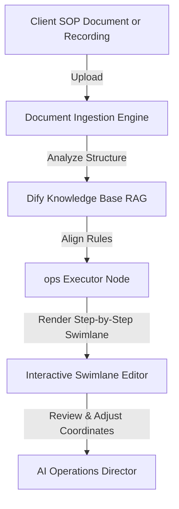

# 📈 Agency Admin Convergence-Ai™: Strategic Scaling & Workforce Upskilling Blueprint

This blueprint outlines the product positioning, workforce transition strategies, custom process ingestion models, pricing tier architectures, and deployment verification plans for the **ops Convergence-Ai™**.

---

## 1. The Human Expansion Narrative (Reframing the Value Proposition)

### ❌ What to Avoid (Replacement Framing)
*   *Do not say*: "Eliminate administrative headcount," "replace human assistants," or "cut payroll costs by 60%."
*   *Why*: This triggers worker anxiety, slows adoption, compromises internal organizational buy-in, and damages brand trust in sensitive sectors.

### ✅ What to Emphasize (Expansion & Leverage Framing)
*   **Operational Leverage**: "Multiply the output capacity of your existing staff by 3x without increasing work hours."
*   **The AI Force Multiplier**: The ops system acts as an infrastructure utility (like an operating system or CRM) that handles repetitive data routing so humans can focus on high-touch client relationships, strategy, and quality oversight.
*   **Staff Promotion**: Position the system as a tool that promotes administrative assistants to **AI Operations Directors** and customer support reps to **Experience Designers**.

---

## 2. Workforce Upskilling & HITL Growth Prospecting

The **Human-in-the-Loop (HITL) model** is not just a quality control check; it is a strategic upskilling pathway that transforms traditional administrative staff into revenue-generating growth drivers.

### 💰 Modular Upcharging & Reseller Licensing Model
To support dynamic revenue generation, the **Workforce Transition & Strategic Upskilling Matrix** is built as a modular add-on:
*   **Pricing**: Standalone upgrade of **+$49/month** for client license agreements.
*   **Consultant Package**: Resellers and consultants can bundle this with a premium **$499 setup and configuration fee**, during which they customize employee persona targets and audit parameters.
*   **Automatic Inclusions**: Bundled natively into **Tier 2: Growth Office ($499/mo)** and **Tier 3: Enterprise Elite ($1,200/mo)** to incentivize subscription migrations.

### 🗺️ The Upskilling Transition Matrix

| Original Role | Reclaimed Hours | New Strategic Title | New Revenue & Growth Focus |
| :--- | :--- | :--- | :--- |
| **Administrative Assistant** | 15 hrs/week | **AI Operations Director** | Tracks business efficiency metrics, manages the integration queue, and identifies process bottlenecks. |
| **Customer Support Representative** | 20 hrs/week | **Customer Experience Architect** | Implements VIP client follow-up sequences, coordinates escalations, and builds retention programs. |
| **Bookkeeper / Invoice Clerk** | 12 hrs/week | **Cash Flow Analyst** | Audits payment trends, manages vendor margin optimizations, and runs cost-projection scenarios. |
| **Junior Marketing Coordinator** | 18 hrs/week | **AI Content Director & Campaign Lead** | Reviews auto-drafted SEO calendar campaigns, audits target keywords, and optimizes ad allocations. |

### 🔍 Prospecting New Growth Drivers during HITL Training
During the 90-day training onboarding, consultants and team leads audit daily operations to identify:
1.  **Lost Leads**: Answering logs from the Twilio 24/7 console are parsed using LLMs to cluster missed customer desires (e.g., "30% of callers asked if we provide service X, which we don't currently advertise").
2.  **Cycle-Time Leaks**: Identifying which stages in the Procure-to-Pay swimlane take the longest for physical validation, pointing to areas where staff need better decision frameworks.

---

## 3. Custom Process Ingestion: How SMBs Feed Their Workflows

For the ops Convergence-Ai™ to become the go-to SMB solution, businesses must be able to feed their custom processes into the system without writing code.



### Ingestion Mechanisms for SMBs:
1.  **The SOP Document Parser (RAG Ingestion)**:
    *   SMBs upload their existing Standard Operating Procedures (SOPs) or team checklists (PDF, DOCX, or text files) directly to their private Supabase DB instance.
    *   A local retrieval-augmented generation (RAG) loop parses the guidelines, aligning the agent's email drafting and invoice matching rules with company policies.
2.  **No-Code Visual Swimlane Customizer**:
    *   Instead of editing raw n8n JSON nodes, users access a drag-and-drop dashboard portal. 
    *   They visually select what triggers an action (e.g., "New HubSpot Deal Closed"), which systems are involved, and where the **HITL Approval Queue Gate** should freeze execution for human review.
3.  **Loom Video/Speech-to-Workflow Recorder**:
    *   Users record a short video/audio walkthrough explaining how they perform a task.
    *   The Dify agent transcribes the recording, extracts the logical steps, and generates a structured workflow roadmap draft for approval.

---

## 4. Realistic & Scalable Pricing Tiers

A starting price of $99/mo is highly accessible, but it must scale logically with resources, usage, and seat count to make business sense and align with cloud hosting COGS.

### 💰 Tiered Licensing Model

```
+-----------------------------------------------------------------------------+
| TIER 0: SOLOPRENEUR / FREELANCE                                 $99 / month |
| - 1 User Seat | Standard Integrations (M365, Gmail) | Local Database Backup   |
+-----------------------------------------------------------------------------+
                                      |
                                      v
+-----------------------------------------------------------------------------+
| TIER 1: STARTER TEAM / SMB                                     $249 / month |
| - Up to 5 Seats | QuickBooks/Xero Integration | Staged HITL Queue Portal    |
+-----------------------------------------------------------------------------+
                                      |
                                      v
+-----------------------------------------------------------------------------+
| TIER 2: GROWTH OFFICE                                          $499 / month |
| - Up to 15 Seats | Full Twilio 24/7 Call Fielding | Custom CRM integrations |
+-----------------------------------------------------------------------------+
                                      |
                                      v
+-----------------------------------------------------------------------------+
| TIER 3: ENTERPRISE ELITE (PRIVATE CLOUD)                    $1,200 / month  |
| - Unlimited Seats | GCP Cloud Run VPC isolation | Custom RAG SOP Indexes  |
+-----------------------------------------------------------------------------+
```

*   **Tier 0: Solopreneur ($99/month)**: Target is solo virtual assistants and independent consultants. Single-user access, default templates.
*   **Tier 1: Starter Team / SMB ($249/month)**: Target is small teams (up to 5 seats). Includes standard accounting sync (QuickBooks/Xero) and the basic HITL queue dashboard.
*   **Tier 2: Growth Office ($499/month)**: Target is mid-sized companies (up to 15 seats). Includes the Twilio 24/7 Call Answering Console, full speech-to-text logging, and custom CRM syncs.
*   **Tier 3: Enterprise Elite / Private Cloud ($1,200+/month)**: Target is legal, medical, or financial offices requiring compliance audits. Includes complete VPC deployment isolation on the client's GCP/AWS space, custom RAG SOP document parsing, and unlimited seats.

---

## 5. Claim Accuracy & Verification (Ensuring No Gaps)

To ensure the promotional schedule makes no false claims, we must implement a local verification and testing roadmap before public deployments.

### 🧪 Verification & Testing Program

1.  **Establish a Sandbox Testing Environment**:
    *   Configure a local docker stack on a test machine to mirror the exact production container setup.
    *   Set up a **QuickBooks Sandbox Account** and a **Microsoft 365 Developer Sandbox** (which provides free test emails and calendars) to execute real OAuth 2.0 handshakes.
2.  **Verify the Base64 Cryptographic License Keys**:
    *   Run test assertions on the Base64 token generation script in `run_tests.js`.
    *   Verify that if the token is tampered with, PostgreSQL Row-Level Security immediately blocks database reads, proving the "Vault-Grade Security Gateway" works.
3.  **Audit the Twilio Answering Console**:
    *   Configure a test Twilio number and execute voice calls to verify speech-to-text conversion accuracy and check if call transcripts are correctly written to the local database.
    *   Verify that the "HITL freeze" triggers correctly when an emergency call is routed.
4.  **Confirm GCP Deployment Costs**:
    *   Deploy a pilot backend instance to GCP Cloud Run.
    *   Monitor the billing dashboard over 30 days to verify that scaling-to-zero when idle keeps the monthly compute cost within the projected **$0.00 to $5.00/month** range.
