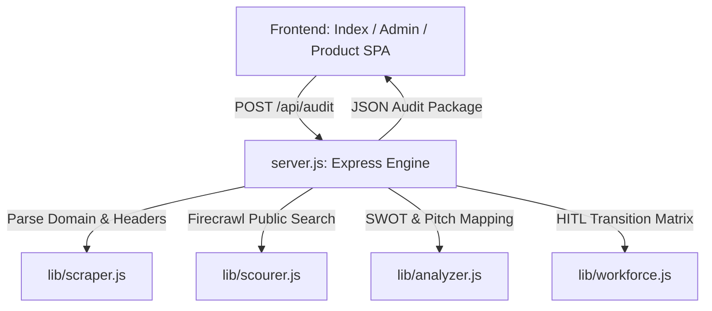
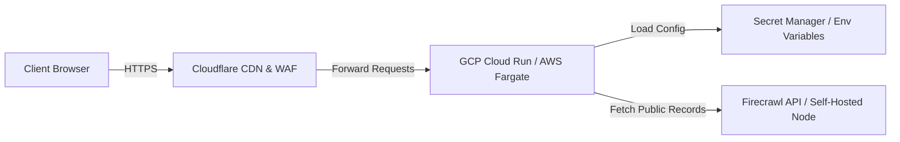

# 📄 CONVERGENCE-Ai SMB External Audit Engine: System Handover Specification
*Prepared for integration with downstream agent networks and developers*

---

> [!NOTE]
> This document details the **CONVERGENCE-Ai SMB External Audit Engine & Workforce AI Planner**. It is designed to be fed directly into another Antigravity or AI agent session, allowing it to instantly understand the system's capabilities, architecture, APIs, operating costs, deployment models, and Human-in-the-Loop (HITL) consulting frameworks.

---

## 1. Executive Summary & Capabilities

The **CONVERGENCE-Ai SMB External Audit Engine** is a modular, obsidian-themed Node.js application built to automate pre-sales intelligence, technical auditing, and corporate workforce AI transformation planning for Small and Medium Businesses (SMBs). 

Rather than requiring private administrative credentials, it scours public footprints to construct high-value sales proposals and operational roadmaps in under 2 seconds.

### Core Capabilities
*   **🌐 Relational Domain Ingestion:** Resolves subdomains (e.g., `www`, `mail`, `portal`), scrapes active metadata (titles, descriptions, social links), and identifies structural framings.
*   **🛡️ Edge Firewall & WAF Probing:** Inspects real-time HTTPS handshakes to identify Web Application Firewalls (Cloudflare, AWS WAF, Imperva, Akamai, Sucuri) and flags security header vulnerabilities (HSTS, CSP, X-Frame-Options, CORS).
*   **🔍 State & Federal Regulatory Scouring:** Connects to the **Firecrawl API** to search public records, state secretary registries (CA, DE, NY), SEC CIK numbers, IRS EIN statuses, CMS NPI provider databases, and regional news mentions.
*   **📊 Algorithmic SWOT Scoring:** Computes performance metrics for Technology Modernization, Security Posture, and Marketing Integrations to derive an overall Maturity Grade (A+ down to F).
*   **🤖 Workforce AI Transition Planner (HITL):** Evaluates team roles and structures, maps automation exposure (vulnerability scores), grades current digital literacy, and drafts a custom **90-Day Human-in-the-Loop (HITL) Transition Timeline**.
*   **💼 Sales Pitch Generator:** Automatically pairs detected technical gaps with customizable outreach templates, complete with estimated implementation pricing and calculated ROI metrics.
*   **📄 Executive Exporters:** Generates polished client handouts via Microsoft Word Open XML (`.docx`) and optimized print-ready PDFs.

---

## 2. Technical Architecture & File Map

The codebase is built on an Express backend serving a lightweight, premium vanilla CSS front-end SPA.



### Module Breakdown:
1.  **[server.js](file:///c:/Users/dahao/.gemini/antigravity/scratch/aiwx-smb-auditor/server.js):** Spins up Express (Port 3000), configures strict anti-cache middleware, and handles unified orchestration endpoints (`/api/audit` and `/api/sample-domains`).
2.  **[lib/scraper.js](file:///c:/Users/dahao/.gemini/antigravity/scratch/aiwx-smb-auditor/lib/scraper.js):** 
    *   Cleans and normalizes URLs.
    *   Triggers live HTTPS requests to extract response headers and identify security patterns.
    *   Features a **Premium Mock Fallback** that dynamically models domain data structures by vertical if no Firecrawl API Key is supplied.
3.  **[lib/scourer.js](file:///c:/Users/dahao/.gemini/antigravity/scratch/aiwx-smb-auditor/lib/scourer.js):** Integrates Firecrawl search modules to parse estimated revenues, YoY growth levels, headcount figures, state filings, and public news mentions.
4.  **[lib/analyzer.js](file:///c:/Users/dahao/.gemini/antigravity/scratch/aiwx-smb-auditor/lib/analyzer.js):** Houses the metrics scoring logic and contains the target outreach templates mapped to vertical-specific gaps.
5.  **[lib/workforce.js](file:///c:/Users/dahao/.gemini/antigravity/scratch/aiwx-smb-auditor/lib/workforce.js):** Implements a roles taxonomy database mapping job descriptions to automation risks, transition titles, upskilling modules, and timeframes.

---

## 3. Maintenance, Testing, & Dependencies

### Package Dependencies
*   `express` (^4.19.2) - Backend routing framework.
*   `dotenv` (^16.4.5) - Local secret management.
*   `@mendable/firecrawl-js` (^1.0.0) - Remote scraping/search client.

### Developer Commands
*   **Install:** `npm install`
*   **Run Development Server:** `npm run dev` (utilizes nodemon) or `npm start` (runs node directly).
*   **Execute Test Suite:** `npm test` (Runs [test/run.js](file:///c:/Users/dahao/.gemini/antigravity/scratch/aiwx-smb-auditor/test/run.js) executing 31 unit & integration tests verifying calculations, domain cleaning, scoring formulas, and regulatory mock fallbacks).

> [!WARNING]
> Do not deprecate the **Smart Simulator Fallback** in `lib/scraper.js` and `lib/scourer.js`. If `process.env.FIRECRAWL_API_KEY` is missing or invalid, the engine must continue to generate vertical-accurate mock files to ensure the client-facing UI never throws a blank state.

---

## 4. Hosting & Direct Operating Costs

When deployed as a central SaaS platform by CONVERGENCE-Ai, the direct operating costs are extremely low:

| Expense Category | Service Provider / Scope | Monthly Cost (USD) |
| :--- | :--- | :--- |
| **Backend Compute** | Render / Railway / Fly.io (Node.js Container) | $0.00 - $7.00 |
| **Frontend CDN** | Cloudflare Pages / Vercel (Static Assets) | $0.00 |
| **API Ingestion** | Firecrawl (API Key) | $0.00 (Free Tier: 500 credits) <br> $19.00 (Starter: 5,000 credits) <br> $99.00 (Standard: 50,000 credits) |
| **Model APIs** | None (Algorithms & Regex templates run locally) | $0.00 |
| **Total Baseline** | **Central SaaS Operations** | **$0.00 - $26.00 / month** |

---

## 5. Client Cloud Deployments & Infrastructure Costs

If a large enterprise or government client requests this tool to be deployed within their own isolated cloud environment (e.g., for data privacy or compliance reasons), the architecture and cost structures scale as follows:



### AWS Deployment Specifications & Cloud Costs
*   **Compute (AWS Fargate on ECS):**
    *   *Configuration:* 1 vCPU, 2GB RAM container instance running the Express backend.
    *   *Cost:* ~$10.00 - $15.00/month (assuming continuous run, or drops to near $0 if utilizing ECS scale-to-zero settings).
*   **Content Delivery (AWS CloudFront / ALB):**
    *   *Configuration:* Direct traffic management, SSL termination, and static asset caching.
    *   *Cost:* ~$5.00/month (dependent on bandwidth traffic limits).
*   **Secret Management (AWS Secrets Manager):**
    *   *Configuration:* Stores the `FIRECRAWL_API_KEY`.
    *   *Cost:* $0.40/month.
*   **Total AWS Infra Cost:** **~$15.00 - $20.00 / month**.

### Google Cloud (GCP) Deployment Specifications & Cloud Costs (Recommended)
*   **Compute (GCP Cloud Run):**
    *   *Configuration:* Serverless container scaling to 0 instances when idle. Minimum instances = 0, maximum = 2.
    *   *Cost:* **~$0.00 - $5.00/month** (highly optimized for low-volume consultant audits, utilizing GCP's free tier allocation of 2 million requests/month).
*   **Secret Management (GCP Secret Manager):**
    *   *Configuration:* Stores variables secure environment keys.
    *   *Cost:* $0.06/month.
*   **Security (Cloudflare Free Tier):**
    *   *Configuration:* DNS registrar and SSL provider.
    *   *Cost:* $0.00/month.
*   **Total GCP Infra Cost:** **~$0.00 - $5.06 / month**.

---

## 6. The Human-in-the-Loop (HITL) Transition Model

The core philosophy of the **CONVERGENCE-Ai Workforce Planner** is that AI should not wholesale replace human labor in SMBs. Instead, it advocates for a **Human-in-the-Loop (HITL) Model**, where existing staff are upskilled to act as "AI Operators" and "Validators" of automated output.

### The HITL Upskilling Loop:
```
[AI Generator/Scraper Node] ---> [Raw Structured Draft] ---> [Human Validator/Auditor] ---> [High-Fidelity Output]
```

Without the human element, fully automated outputs suffer from hallucination and styling drift. Upskilling ensures high-quality brand safety while multiplying worker productivity.

### Core Role Transitions Configured in Engine:

| Original Staff Role | HITL Transition Title | Core Responsibility |
| :--- | :--- | :--- |
| **Customer Support Rep** | AI Helpdesk Trainer & Live Escalator | Curates the local support vector database (RAG) and steps in only on low-confidence flags. |
| **Billing Specialist** | AI Medical Coding & Claims Auditor | Uses OCR to parse intake notes, validating AI-generated insurance ICD codes before submitting. |
| **Marketing Coordinator** | AI Content Director & Ad Campaign Overseer | Crafts prompt templates for SEO content generation, acting as chief editor and brand voice guardian. |
| **Junior Associate / Clerk** | AI Research Analyst & Validator | Deploys web-connected scrapers to compile briefs, verifying citations and data points. |

---

## 7. HITL Upskilling Training & Consulting Pricing Models

Consultants using the Audit Engine can package the workforce transition plan into premium, high-margin training agreements. Below is the operational framework for delivery:

### The 90-Day HITL Consulting Timeline
1.  **Immediate (1 - 30 Days) - Alignment Phase:**
    *   *Actions:* Deploy corporate generative AI policy guidelines; audit daily time-sinks in support/admin queues.
    *   *Objective:* Identify baseline friction and establish safe usage rules.
2.  **Mid-Term (31 - 90 Days) - Pilot Phase:**
    *   *Actions:* Onboard staff onto interactive tools (Make.com, Voiceflow, custom prompt sandboxes); run pilot tests.
    *   *Objective:* Transition from typing manual documents to auditing draft mockups.
3.  **Long-Term (90+ Days) - Scale Phase:**
    *   *Actions:* Promote operators to AI Auditors; scale API triggers; review monthly efficiency savings.
    *   *Objective:* Secure structural operations growth.

### Consultant Sales Packaging & Delivery Costs

Consultants can propose three tiers of HITL service agreements based on the target client's scale (as supported by `/product.html`):

*   **Consultant Suite ($4,500 One-time Workshop Setup):**
    *   *Target:* B2C Local Retail / Boutique Services (~5-15 employees).
    *   *What's Included:* 1-day team training workshop + custom prompt template books for support and admin.
    *   *Estimated Client ROI:* Captures 40% more out-of-office bookings; offloads 60% of basic support queries.
*   **Agency Growth ($399/Month Managed Maintenance):**
    *   *Target:* Growing Tech / Multi-clinic Healthcare Groups.
    *   *What's Included:* Direct Make.com integrations + custom Voiceflow chat nodes + monthly prompt tuning logs.
    *   *Estimated Client ROI:* Saves 80 hours/month of manual data input; increases Google Maps reviews by 45%.
*   **Enterprise Elite ($999/Month Continuous Optimization):**
    *   *Target:* High-ticket B2B Logistics / Green Infrastructure Firms.
    *   *What's Included:* Custom RAG document search engines + federal SAM proposal builders + quarterly workforce audits.
    *   *Estimated Client ROI:* Cuts federal bid drafting hours by 80%; automates 95% of manual invoice intake.

---
*End of Spec. Copy this markdown block to initialize downstream agent workflows.*
