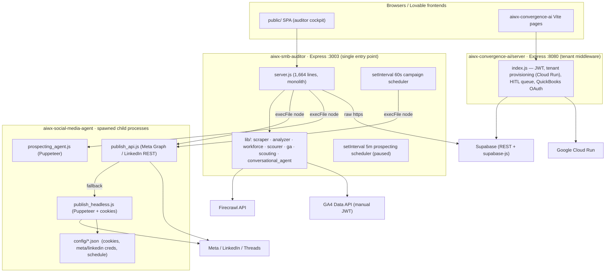
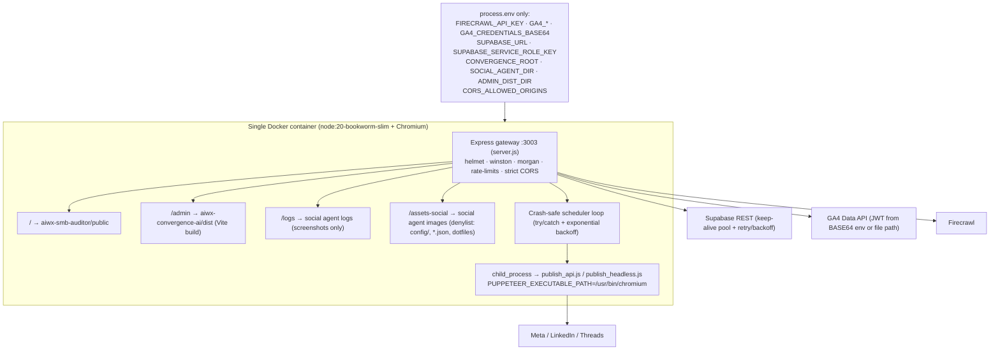
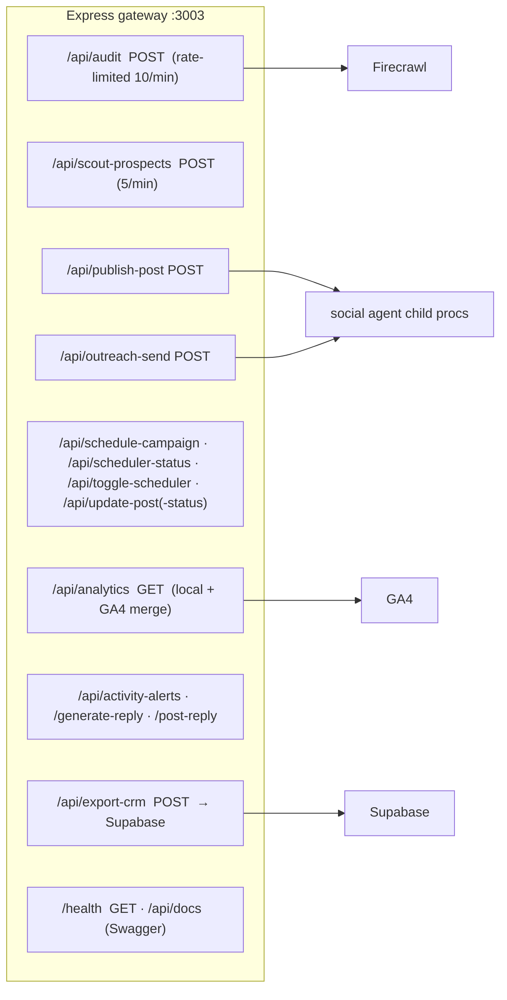

# CONVERGENCE-Ai — System Assessment, Gaps Matrix & Rearchitecture Plan

**Date:** 2026-07-12 · **Author:** Claude (Fable 5) systems review · **Scope:** `aiwx-convergence-ai/`, `aiwx-smb-auditor/`, `aiwx-social-media-agent/`

---

## 1. Competitor Benchmark

**Closest competitor: [Relay.app](https://www.relay.app/)** — an AI workflow-automation platform whose defining feature is
**human-in-the-loop approvals** (pause-for-review, approve/revise/reject steps routed to email/Slack), aimed at SMB
operations/sales/support teams. Pricing: free tier → $19/mo Professional → $138/mo Team (2026). Its February 2026
"Agents" launch repositioned it from workflow automation to "a team of AI agents" — exactly the cockpit-of-agents
positioning CONVERGENCE-Ai targets.

Secondary axes:

| Platform | What it benchmarks for us |
|---|---|
| **Relay.app** | HITL approval UX, agent cockpit, SMB team pricing |
| **Lindy** | Per-function AI agents ("Lindies") over inbox/CRM/support |
| **Gumloop** | Visual no-code agent flow builder |
| **n8n** | Self-host / embed / white-label for resellers |
| **GoHighLevel** | Reseller & white-label SaaS distribution model |

CONVERGENCE-Ai's differentiator vs. all of them: **containerized single-tenant deployment in the client's own cloud**
(flat hosting cost, no per-seat tax) plus a **pre-sales auditor** that generates the sales pipeline itself. No
benchmark competitor bundles prospecting → audit → deployment → HITL operations in one hub.

---

## 2. System Assessment (as found)

### Execution topology

### What's already good
- Helmet, morgan, compression, express-rate-limit and Swagger docs are already wired in `server.js`.
- Boot-time env validation (`FIRECRAWL_API_KEY`, `GA4_PROPERTY_ID`, `GA4_MEASUREMENT_ID`) with fail-fast exit.
- Graceful shutdown + uncaught-exception handlers.
- `execFile` (not `exec`) used for most child-process spawns — argument-safe.
- The admin middleware (`server/index.js`) validates its required env and uses `@supabase/supabase-js` correctly.

### Critical defects found

| # | Severity | Finding |
|---|---|---|
| F1 | 🔴 Critical | `server.js:129` statically serves the **entire** `aiwx-social-media-agent/` directory at `/` — exposing `config/` (session **cookies**, Meta/LinkedIn **access tokens**, Supabase **service-role key**) to any HTTP client. |
| F2 | 🔴 Critical | `POST /api/supabase-credentials` accepts a service-role key over HTTP and writes it to a **plaintext JSON file**; `GET` echoes the URL back. No auth on either. |
| F3 | 🔴 High | `/api/run-prospecting` and the prospecting scheduler pass user input into **`exec()` shell strings** (command-injection surface) and use a **hardcoded Windows path** `c:/Users/dahao/...` — breaks in any container. |
| F4 | 🔴 High | `publish_headless.js` + 6 cookie scripts hardcode `C:\Program Files\Google\Chrome\...` as Puppeteer `executablePath` — cannot run on Linux/cloud. |
| F5 | 🟠 Medium | GA4 auth reads service-account JSON **only from files** (3 fallback paths) — secrets must be baked into the image/disk. |
| F6 | 🟠 Medium | CORS allowlist uses `origin.includes('lovable')` and `includes('localhost')` — `https://evil-lovable.attacker.com` passes. |
| F7 | 🟠 Medium | Hardcoded fallbacks: GA4 measurement ID `G-V2Z3W6F8G2` (server.js:176), vault key `aiwx_kms_vault_secret_key_...` (admin server:70), QuickBooks client id (admin server:752). |
| F8 | 🟠 Medium | Scheduler state = JSON files with read-modify-write races between the in-server 60s loop and `scheduler_daemon.js`; a thrown error inside the interval callback can kill the tick silently; no backoff/recovery. |
| F9 | 🟡 Low | `/api/analytics` blends **simulated** impressions (`Math.random`) into real GA4 numbers; default port is 3000 while docs say 3003; existing per-folder Dockerfile (Alpine) lacks Chromium entirely. |
| F10 | 🟡 Low | Admin `dist/` is never actually served by the gateway despite being described as such — deployed pages are served from `public/` copies instead. |

---

## 3. Gaps Matrix vs. Relay.app benchmark

| Capability | Relay.app | CONVERGENCE-Ai today | Gap | Action (this phase / later) |
|---|---|---|---|---|
| HITL approval queue | ✅ core feature, Slack/email routed | 🟡 `hitl_queue` table + endpoints in admin middleware; approval statuses in campaign JSON | Partial | Later: unify both queues in Supabase, add notification channels |
| Multi-agent cockpit | ✅ (2026 Agents launch) | 🟡 3 agents exist but coupled via filesystem | Partial | **This phase: containerize behind one gateway, env-driven paths** |
| Cloud deployability | ✅ SaaS | 🔴 Windows-desktop-bound (Chrome path, `c:/Users` paths, PowerShell notifications) | Blocking | **This phase: Dockerfile + Linux Chromium + path/env isolation** |
| Secrets hygiene | ✅ managed | 🔴 plaintext creds on disk, served over HTTP | Blocking | **This phase: env-only config, BASE64 GA4 creds, lock static serving** |
| Approval-gated publishing | ✅ approve-before-send | ✅ APPROVED/PENDING statuses + dry-run flags | None | Keep |
| Reseller / white-label | ❌ | ✅ tenant provisioning to client Cloud Run + reseller landing | **Advantage** | Protect: keep single-container story clean |
| Pre-sales auditor | ❌ | ✅ Firecrawl audit + SWOT + workforce planner | **Advantage** | Keep |
| Durable scheduler | ✅ managed runs | 🔴 JSON file + setInterval, race-prone | Blocking for scale | **This phase: crash-safe loop + backoff**; later: move queue to Supabase |
| Observability | ✅ run history | 🟡 console.log only | Partial | **This phase: Winston structured logs + morgan stream** |
| Rate limiting / abuse | ✅ platform-level | 🟡 2 endpoints only | Partial | **This phase: global limiter + publish/outreach limiter** |

---

## 4. Target architecture (this phase)

Volume guidance: mount `/data` for `audits_cache/`, `config/campaign_schedule.json`, `logs/` in cloud deploys
(paths already env-overridable).

## 5. API surface & plan

**Phase-1 (implemented now):** env-only config with fail-fast bounds; GA4 base64 creds; Supabase env-based client
with pooled keep-alive + 3× exponential-backoff retry; locked static mounts; strict CORS; global + per-route rate
limits; Winston/Morgan; crash-safe scheduler; Linux-ready Puppeteer; root Dockerfile + .dockerignore + .env.example.

**Phase-2 (recommended next):** move campaign queue + alerts from JSON files into Supabase tables (`campaign_posts`,
`activity_alerts`) with row-level locking; unify with `hitl_queue`; JWT auth on all mutating endpoints; replace the
`/api/generate-monthly-posts` template engine with a Claude API call; per-tenant API keys for reseller mode.
